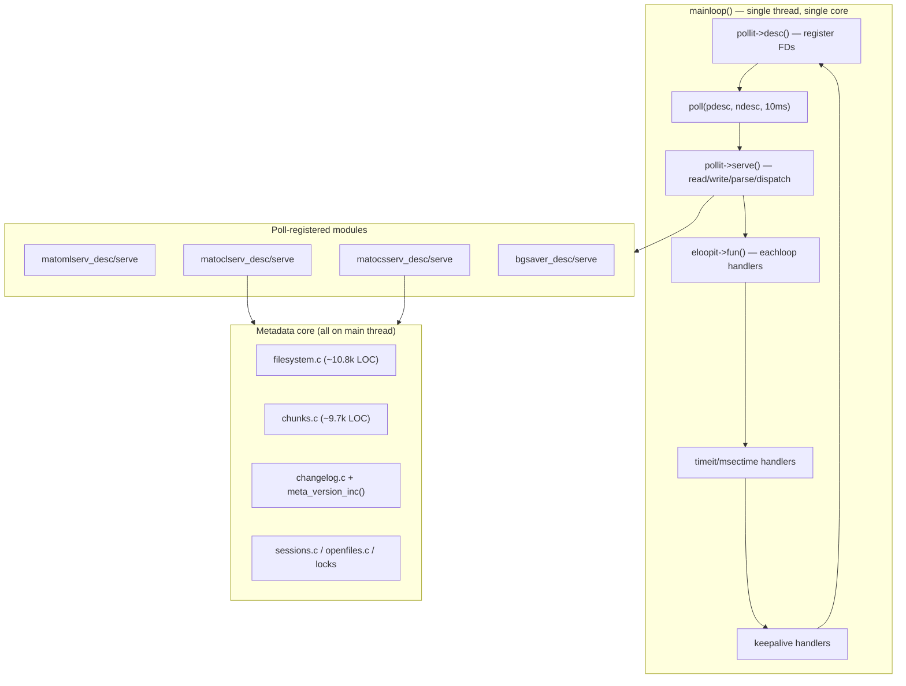
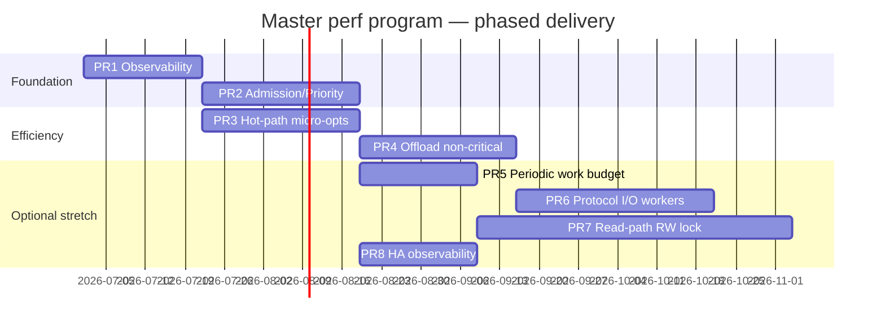
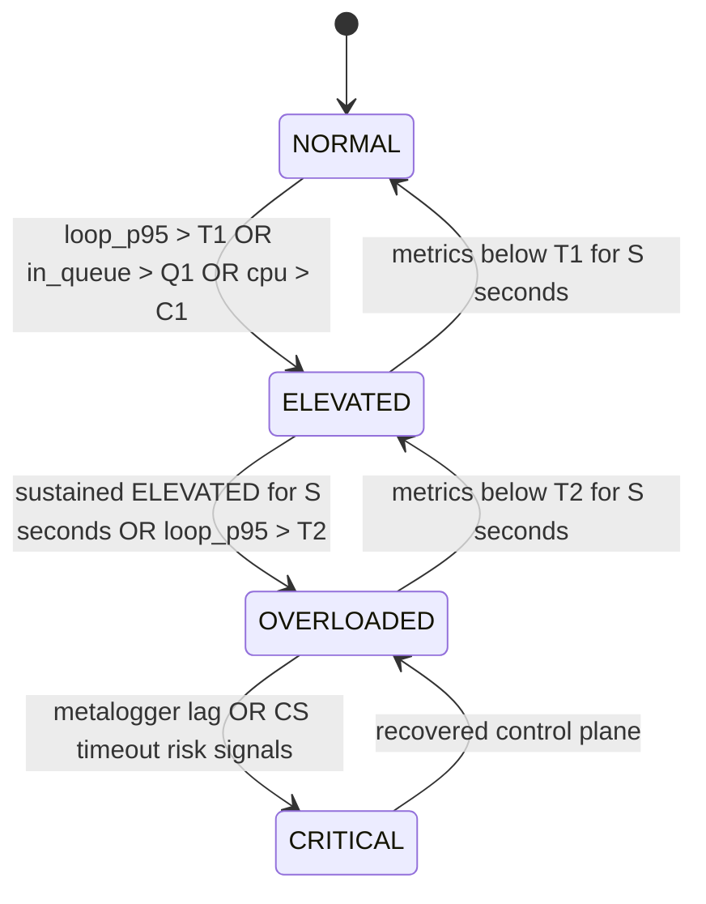
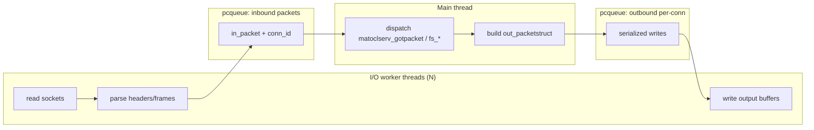
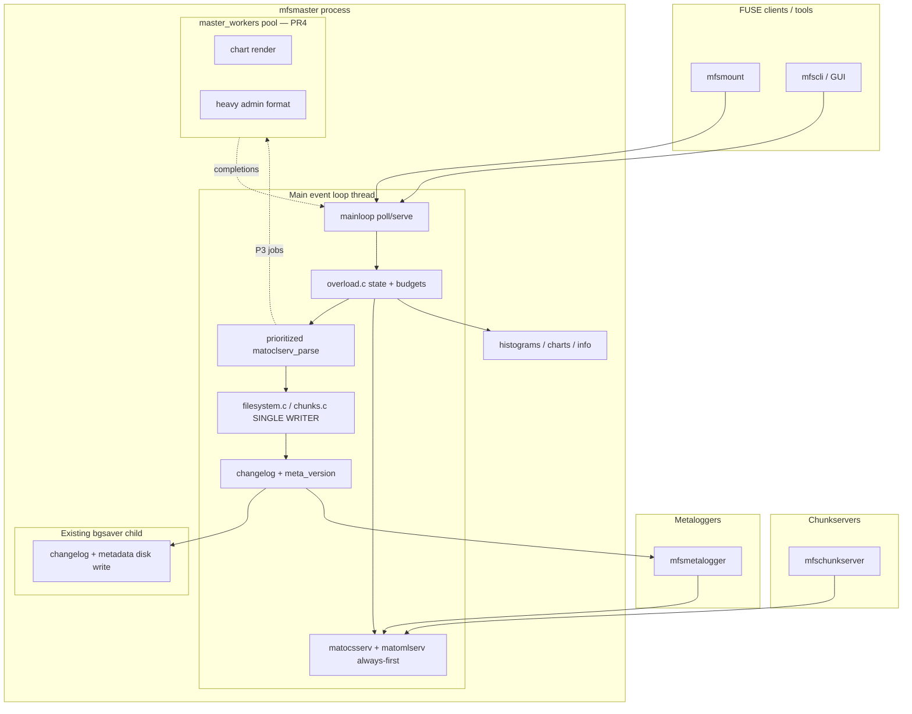
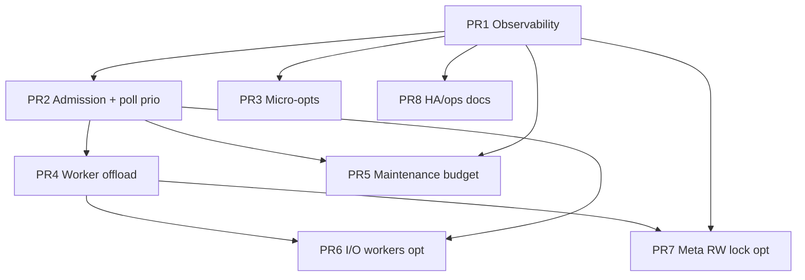

# MooseFS Master Performance & Availability Enhancements

| Field | Value |
|-------|-------|
| **Document Title** | MooseFS `mfsmaster` Performance & Availability Enhancements |
| **Author** | _TBD_ |
| **Date** | 2026-06-22 |
| **Status** | Draft |
| **Primary Audience** | Senior engineers familiar with MooseFS `mfsmaster` / `mfscommon` |
| **Codebase** | `/home/arcyleung/Projects/grok_trace_analysis/moosefs` (MooseFS pure C) |
| **Primary deliverable path** | `/tmp/grok-design-doc-f774a261.md` |
| **In-repo copy** | `docs/master-perf-design.md` |

---

## Overview

`mfsmaster` is an event-loop driven, single-threaded metadata server: all client (`matoclserv`), chunkserver (`matocsserv`), and metalogger (`matomlserv`) I/O, all filesystem/chunk mutations, changelog versioning, and most periodic maintenance run sequentially on one core inside `mainloop()` (`mfscommon/main.c`). Under high metadata load—many clients issuing lookup/getattr/create/stat/readdir/setattr at high rates—that single core saturates, request latency climbs, and the entire cluster effectively stalls even though data-plane chunkservers are healthy.

MooseFS already has HA primitives (metaloggers via `matomlserv`, `mfssupervisor` / `mastersupervisor`, background metadata/changelog writer via `bgsaver.c`), but these address crash-failover and durable logging—not in-process overload resilience. This design proposes an **incremental, correctness-preserving performance program** organized as independently mergeable PRs. It deliberately rejects multi-master consensus rewrites and full multithreaded `filesystem.c`/`chunks.c` as first steps, and instead prioritizes:

1. **Observability** so we can measure before/after and detect overload.
2. **Admission control & request prioritization** so critical control-plane traffic (keepalive, chunkserver heartbeats, metalogger replication) survives client bursts.
3. **Hot-path micro-optimizations** and **offload of non-critical work** (stats, charts, topology refresh, heavy admin queries).
4. **Conservative read-path parallelism** (optional later phase) only after a global metadata lock exists and is validated.
5. **HA/recovery latency improvements** that are feasible incrementally (faster promotion signals, better metrics—not new consensus).

Target outcome: measurable improvement in metadata ops/sec and p99 latency under synthetic and production-like metadata storms, with graceful degradation (clients get `MFS_ERROR_EAGAIN` / delayed responses rather than cluster-wide timeout storms), while preserving the sacred invariant that **metadata mutations remain totally ordered via `meta_version_inc()` + `changelog()` + metalogger broadcast**.

---

## Background & Motivation

### Current architecture (as implemented)

Initialization order is defined in `mfsmaster/init.h` `RunTab[]`:

```
rnd_init → bgsaver_init → glob_cache_init → multilan_init → changelog_init
→ missing_log_init → dcm_init → exports_init → topology_init → meta_init
→ chartsdata_init → matomlserv_init → matocsserv_init → matoclserv_init
```

The runtime is a classic register-and-poll loop (`mfscommon/main.c::mainloop`):



**Client request path (hot path):**

1. `matoclserv_serve` accepts/reads sockets, enqueues `in_packetstruct` on `eptr->inputhead`.
2. `matoclserv_parse` drains packets with a **10 ms per-connection budget** (`starttime+10000>currtime`)—already a crude fairness mechanism.
3. `matoclserv_gotpacket` switches on packet type (`CLTOMA_FUSE_*`, admin commands, charts, etc.).
4. Handlers like `matoclserv_fuse_lookup` parse wire format (`datapack.h` helpers), call `sessions_*` + `fs_lookup` / `fs_getattr` / `fs_create` / …, build reply packets, append to `eptr->outputhead`.
5. Writes (`fs_create`, `fs_setattr`, `fs_writechunk`, …) call `changelog()` which does `meta_version_inc()`, formats a text line, stores in the in-memory old-changes ring, and either:
   - delegates disk write to `bgsaver_changelog()` (`CHANGELOG_SAVE_MODE=0`, default), or
   - writes synchronously (`mode 1/2`).
6. `matomlserv_broadcast_logstring` fans out changelog entries to metaloggers.

**Existing threading / offload (limited):**

| Mechanism | Location | Purpose |
|-----------|----------|---------|
| `bgsaver` child process + pipe protocol | `mfsmaster/bgsaver.c` | Offload metadata snapshot writes and changelog disk I/O |
| `delayrun` | `mfscommon/delayrun.c` | Deferred function execution (used by client/chunkserver code) |
| `pcqueue` | `mfscommon/pcqueue.c` | Thread-safe producer/consumer queue (used by workers/chunkserver/client libs; **not** by master metadata path) |
| `workers` | `mfscommon/workers.c` | Worker pool (chunkserver/client; **not** master metadata) |
| `lwthread` | `mfscommon/lwthread.c` | Thin pthread wrapper |
| `USE_PTHREADS` in `main.c` | only protects `now` clock with `nowlock` | Not a general concurrency model |

**Existing overload awareness (elsewhere, not for master CPU):**

- Chunkserver heavy-load status (`hlstatus`, `HLSTATUS_OVERLOADED`) in `matocsserv.c` / `csdb.c`—affects write/replication placement, not master admission.
- `long loop detected` syslog when a single `mainloop` iteration exceeds 5 seconds (`main.c`).
- Per-module `LOOP_START`/`LOOP_END` timing when `lcall_trigger` is enabled (debug profiling).
- Charts counters for op rates and CPU (`chartsdefs.h`: `CHARTS_UCPU`, `CHARTS_LOOKUP`, `CHARTS_CREATE`, …) but **no latency percentiles, no queue depth, no overload signal**.

### Pain points

1. **Single-core metadata bottleneck.** `filesystem.c` + `chunks.c` + all protocol dispatch share one thread. Hash tables (`nodehashtab`, `edgehashtab`, `chunkhashtab`) are already well-engineered (incremental rehash, mmap slabs), but all accesses are serialized by the event loop.
2. **No prioritization.** A flood of `CLTOMA_FUSE_CREATE` / `LOOKUP` from thousands of clients competes equally with `matocsserv` heartbeats and `matomlserv` log replication. Control-plane starvation can cause false chunkserver disconnects and metalogger lag—amplifying a metadata storm into an apparent cluster failure.
3. **Admin / observability work on the hot path.** Unregistered-client handlers in `matoclserv_gotpacket` include `CLTOAN_CHART`, `CLTOMA_CHUNKS_MATRIX`, `CLTOMA_MASS_RESOLVE_PATHS`, `CLTOMA_FULL_DIRECTORY_DATA`, session lists, etc. These can allocate/scan large structures while client FUSE traffic waits.
4. **Periodic work interleaved with request handling.** `main_time_register` / `main_msectime_register` handlers run on the same thread: `fs_test_files` (100 ms), quota checks, trash emptying, `matocsserv_calculate_space`, `matocsserv_recalculate_server_counters` (eachloop), `sclass_fix_matching_servers_fields`, `chartsdata_refresh` (60 s), `meta_store_task`, etc.
5. **HA does not help with overload.** Metaloggers and supervisors help with master **crash** recovery; an overloaded-but-alive master continues serving poorly until it crashes or clients time out. Failover then imposes metadata load + changelog replay cost on the successor.
6. **Limited ability to quantify improvement.** Existing charts track counts/rates, not latency distributions or internal queueing delay. Optimization PRs risk being unmeasurable.

### Why incremental is mandatory

`filesystem.c` (~10.8k LOC), `chunks.c` (~9.7k LOC), and `matoclserv.c` (~7.5k LOC) embody decades of correctness constraints: changelog replay via `fs_mr_*` / `restore.c`, metalogger compatibility, session/open-file/lock state, EC/goal/sclass interactions, quota, ACL, xattr, snapshots. A full multi-threaded metadata server or multi-master consensus system is a multi-year rewrite with unacceptable risk. This design prioritizes **high-ROI, low-blast-radius changes** that preserve the single-writer metadata model while reducing avoidable work and protecting critical paths.

---

## Goals & Non-Goals

### Goals

| # | Goal | Success signal |
|---|------|----------------|
| G1 | Reduce master CPU bottleneck under high metadata I/O | ≥20–40% improvement in steady-state metadata ops/sec on a fixed single-core benchmark; lower CPU% at same load |
| G2 | Improve resilience under overload (graceful degradation) | Control-plane (CS/ML keepalive, metalogger log stream) remains healthy while client ops are shed/delayed; p99 client latency bounded rather than unbounded timeout storms |
| G3 | Implementable incrementally in pure C without master rewrite | Each PR independently reviewable/mergeable; default-off or safe-default knobs where behavior changes |
| G4 | Preserve metadata correctness | Changelog total order, metalogger compatibility, `fs_mr_*` restore path unchanged in semantics; no dual-writer races |
| G5 | Wire-protocol compatibility | Existing clients/chunkservers/metaloggers work unchanged; any new protocol is version-gated |
| G6 | Observability first | Latency histograms, queue depths, overload state exposed via charts/syslog/info before relying on optimizations |

### Non-Goals

| # | Non-Goal | Rationale |
|---|----------|-----------|
| NG1 | Multi-master active-active consensus (Raft/Paxos-style) | Multi-year effort; out of scope |
| NG2 | Fully multithreaded `filesystem.c`/`chunks.c` with fine-grained locking in phase 1 | Correctness risk too high; deferred as optional future phase only |
| NG3 | Changing on-disk metadata format or changelog line grammar | Breaks metaloggers/restore; not needed for perf |
| NG4 | Client-side protocol redesign (FUSE mount caching strategy is orthogonal) | Client caches (`dirattrcache`, `negentrycache`, etc.) help but are out of master scope |
| NG5 | Replacing the poll event loop with libuv/io_uring as a prerequisite | Possible micro-win later; not the bottleneck vs. metadata CPU |
| NG6 | Guaranteeing linear scalability with CPU cores | Single-writer metadata inherently limits write scaling; we aim for better single-core efficiency + read offload later |

---

## Key Decisions

| ID | Decision | Rationale |
|----|----------|-----------|
| **KD1** | **Keep single-writer metadata semantics on the main thread as the correctness invariant.** All `fs_*` / `chunk_*` mutations and `meta_version_inc()`/`changelog()` remain totally ordered on the event-loop thread in phases 0–3. | Preserves existing changelog/metalogger/restore model with minimal correctness risk. Parallelism is confined to non-metadata work and, optionally, read-only ops behind a global lock introduced carefully. |
| **KD2** | **Observability (PR1) ships before behavioral changes.** Latency histograms, loop-time metrics, per-class queue depths, and an explicit overload state machine land first. | Without metrics, prioritization and micro-opts cannot be validated; reduces risk of optimizing the wrong path. |
| **KD3** | **Admission control & prioritization (PR2) is the highest-ROI resilience lever.** Classify packets into priority classes; under overload, defer/reject low-priority client metadata ops while always serving CS/ML/keepalive/metalogger traffic. | Prevents metadata storms from inducing false CS disconnects and metalogger lag—often worse than the original overload. Uses existing `MFS_ERROR_EAGAIN` (45) which clients can retry. |
| **KD4** | **Prefer offload & micro-opts over protocol I/O worker threads initially.** Stats aggregation, chart rendering, heavy admin scans, and optional response serialization get offloaded via existing `pcqueue`/`workers`/`delayrun` patterns. Packet parse/serialize worker pool is a later optional PR only if profiling shows it dominates. | Master bottleneck is usually metadata logic + allocations, not kernel socket I/O. Worker-thread I/O adds complexity (connection affinity, output ordering) with uncertain gain. |
| **KD5** | **Read-path parallelism is phase 4 (optional), not phase 1.** Introduce `meta_rwlock` (or equivalent) only after phases 0–3 stabilize; allow concurrent `fs_lookup`/`fs_getattr`/`fs_readdir`/`fs_statfs`/`fs_readlink`/`fs_readchunk` (read-only subset) with writes exclusive. | Fine-grained locking of `fsnode`/`chunk` graphs is infeasible incrementally; a global RW lock is the only realistic intermediate step. Still non-trivial due to internal mutators in nominally "read" paths (atime, stats counters, incremental rehash progress). |
| **KD6** | **Do not pursue multi-master consensus in this program.** HA work limited to better overload signaling, supervisor/metalogger observability, and documentation of recovery-time improvements that don't require new replication protocols. | Aligns with "incremental, realistic" constraint; crash-failover already exists via metaloggers + supervisor. |
| **KD7** | **Feature flags / config knobs for all behavior changes.** New options in `mfsmaster.cfg` with safe defaults (admission off or high limits; prioritization enabled conservatively). | Operators can disable on upgrade; A/B testing in production. |
| **KD8** | **Reject approaches requiring multi-year rewrites** (full actor-model master, sharded inode ownership across processes, synchronous multi-master writes). Record as future research only. | Scope discipline; delivers value in months not years. |

---

## Proposed Design

### Design phases (summary)



### Phase 0 — Current-state request classification (design input)

Define explicit priority classes for all traffic handled in `mainloop`. This classification drives PR2 and informs offload decisions.

| Class | Priority | Examples | Overload policy |
|-------|----------|----------|-----------------|
| **P0 — Control** | Highest | `ANTOAN_NOP`, connection keepalive writes, `matocsserv` register/status/chunk-op replies in flight, `matomlserv` log/register/timeout, `bgsaver` pipe I/O, signal handling | Always process; never reject |
| **P1 — Critical metadata** | High | `CLTOMA_FUSE_WRITE_CHUNK_END`, `CLTOMA_FUSE_FSYNC`, in-flight chunk status completions (`matoclserv_chunk_status`), lock wakeups | Process unless extreme; prefer delay over drop |
| **P2 — Normal metadata R/W** | Normal | `LOOKUP`, `GETATTR`, `SETATTR`, `CREATE`, `MKDIR`, `UNLINK`, `READDIR`, `OPEN`, `READ_CHUNK`, `WRITE_CHUNK`, … | Rate-limit / defer under overload; may return `MFS_ERROR_EAGAIN` |
| **P3 — Bulk / admin / observability** | Low | `CLTOAN_CHART`, `CLTOAN_CHART_DATA`, `CLTOMA_CHUNKS_MATRIX`, `CLTOMA_MASS_RESOLVE_PATHS`, `CLTOMA_FULL_DIRECTORY_DATA`, `CLTOMA_SESSION_LIST`, `CLTOMA_CSERV_LIST`, `CLTOMA_QUOTA_INFO`, large `CLTOMA_INFO` | Queue with strict budget; reject or throttle first |

Implementation sketch for classification (new header `mfsmaster/reqclass.h`):

```c
typedef enum {
    MFS_REQ_P0_CONTROL = 0,
    MFS_REQ_P1_CRITICAL = 1,
    MFS_REQ_P2_METADATA = 2,
    MFS_REQ_P3_ADMIN    = 3
} mfs_req_prio_t;

mfs_req_prio_t matocl_packet_prio(uint32_t type, uint8_t registered);
/* matocs/matoml always P0 at module level; internal subdivision optional */
```

### Phase 1 — Observability foundation (PR1)

#### 1.1 Loop and handler timing

Extend the existing `LOOP_START`/`LOOP_END` infrastructure in `mfscommon/main.c` (currently only active when `lcall_trigger > 0`) to always maintain lightweight counters:

```c
/* mfscommon/main_stats.h — new */
typedef struct main_loop_stats {
    uint64_t loop_count;
    uint64_t loop_time_us_sum;
    uint64_t loop_time_us_max;      /* reset on read or every second */
    uint64_t poll_wait_us_sum;
    uint64_t serve_time_us_sum;     /* aggregate pollit->serve */
    uint64_t eloop_time_us_sum;
    uint64_t timer_time_us_sum;
    /* per-module serve time: indexed by poll registration order or fixed slots */
    uint64_t matocl_serve_us;
    uint64_t matocs_serve_us;
    uint64_t matoml_serve_us;
    uint64_t bgsaver_serve_us;
} main_loop_stats_t;

void main_stats_snapshot(main_loop_stats_t *out); /* resets max fields */
```

Log at most once per minute when `loop_time_us_max > threshold` (configurable, default 100 ms) at `NOTICE`, escalating existing 5 s `WARNING` for true stalls.

#### 1.2 Request latency histograms

In `matoclserv.c`, timestamp each packet at enqueue (`in_packetstruct` gains `uint64_t enqueued_us`) and at completion in `matoclserv_gotpacket` tail / per-handler. Maintain HDR-style or simple fixed-bucket histograms:

| Bucket edges (µs) | Purpose |
|-------------------|---------|
| <100, <250, <500, <1k, <2.5k, <5k, <10k, <25k, <50k, <100k, <250k, <1s, ≥1s | Covers cache-hit lookups through overloaded stalls |

Aggregate globally and optionally top-N session IDs for "noisy neighbor" debugging (ring buffer, not per-session histograms to limit memory).

Expose via:
- New chart series in `chartsdefs.h` (e.g., `CHARTS_MATOCL_LAT_P50/P95/P99` as approximate gauges updated every `chartsdata_refresh` interval).
- `main_info_register` callback dumping text histograms to the info log (SIGUSR-triggered path already exists as signal `\004`).
- Optional: extend `CLTOMA_INFO` response **only if** client version negotiation allows (otherwise keep internal/syslog/charts only to avoid protocol break).

#### 1.3 Queue depth gauges

Track:
- Sum of pending `in_packetstruct` across all `matoclserventry` (input queue depth).
- Sum of pending `out_packetstruct` (output backlog—indicates slow clients).
- Count of registered clients / chunkservers / metaloggers (already partially available).
- `old_changes_total_size` / version lag vs. metalogger min version (`changelog.c` / `matomlserv_get_min_version()`).

#### 1.4 Overload state machine



State stored in `mfsmaster/overload.c` (new), queryable by admission control. Config (all reloadable via existing `cfg` + `main_reload_register` pattern):

```
# mfsmaster.cfg additions
MASTER_OVERLOAD_LOOP_US_ELEVATED = 50000      # 50ms loop time
MASTER_OVERLOAD_LOOP_US_HIGH = 200000         # 200ms
MASTER_OVERLOAD_INQUEUE_ELEVATED = 10000      # pending client packets
MASTER_OVERLOAD_INQUEUE_HIGH = 50000
MASTER_OVERLOAD_HYSTERESIS_SECONDS = 5
MASTER_ADMISSION_CONTROL = 0                  # 0=off (metrics only), 1=on
MASTER_ADMISSION_P2_MAX_INFLIGHT = 0          # 0=auto from heuristics
MASTER_ADMISSION_P3_MAX_INFLIGHT = 2
MASTER_ADMISSION_REJECT_ERRNO = EAGAIN        # maps to MFS_ERROR_EAGAIN
```

### Phase 2 — Admission control & prioritization (PR2)

#### 2.1 Integration point

Modify `matoclserv_parse` (and symmetrically ensure `matocsserv_serve` / `matomlserv_serve` are always invoked fully—they are separate `pollit` entries and naturally get a turn each loop; prioritization is mainly about **how much P2/P3 work `matoclserv` does per loop**).

Current parse loop:

```c
// matoclserv.c::matoclserv_parse (today)
while (eptr->mode==DATA && (ipack = eptr->inputhead)!=NULL && starttime+10000>currtime) {
    matoclserv_gotpacket(eptr, ipack->type, ipack->data, ipack->leng);
    ...
}
```

Proposed:

```c
// Pseudocode — final code in matoclserv.c + overload.c
while (... && time_budget_remaining()) {
    ipack = eptr->inputhead;
    prio = matocl_packet_prio(ipack->type, eptr->registered);
    if (!overload_admit(prio, eptr)) {
        if (prio >= MFS_REQ_P2_METADATA && overload_should_reject(prio)) {
            matoclserv_send_simple_status(eptr, ipack, MFS_ERROR_EAGAIN);
            dequeue_and_free(ipack);
            overload_stats_inc(REJECTED, prio);
            continue;
        }
        /* defer: leave on queue, stop parsing this conn, try others / next loop */
        overload_stats_inc(DEFERRED, prio);
        break;
    }
    t0 = monotonic_useconds();
    matoclserv_gotpacket(...);
    overload_account_work(prio, monotonic_useconds() - t0);
    dequeue_and_free(ipack);
}
```

Add a **connection-level fair scan**: when deferring, rotate which `matoclserventry` is considered first (simple `static matoclserventry *fair_cursor`) so one aggressive client cannot monopolize the 10 ms budget.

#### 2.2 Global work budget per loop

In addition to per-connection 10 ms budget, add a global metadata work budget per `mainloop` iteration:

```c
// overload.c
typedef struct {
    uint32_t p0_us_budget;   /* effectively unlimited */
    uint32_t p1_us_budget;   /* e.g. 50000 */
    uint32_t p2_us_budget;   /* e.g. 30000 in NORMAL, 10000 in OVERLOADED */
    uint32_t p3_us_budget;   /* e.g. 5000 in NORMAL, 0 in OVERLOADED */
} overload_budgets_t;
```

`matoclserv_serve` checks budgets before processing each packet class. This ensures `matocsserv_serve` and `matomlserv_serve` (called as separate poll entries in the same loop iteration **before or after** depending on `pollhead` link order—**verify and if needed reorder registration** so ML/CS run before CL under overload) get CPU.

**Poll order fix (part of PR2):** In `init.h` / init sequence, `matomlserv_init` and `matocsserv_init` already register before `matoclserv_init`. Because `main_poll_register` **prepends** to `pollhead` (`aux->next = pollhead; pollhead = aux`), **last registered is first served**. That means `matoclserv` is currently served **before** `matocsserv` and `matomlserv`. PR2 must fix this by either:
- changing prepend to append, or
- explicit priority serve pass for P0 modules first.

Recommended: add `main_poll_register_prio(desc, serve, priority)` with stable sort, defaulting existing callers to normal priority; mark matoml/matocs/bgsaver as high.

#### 2.3 Client-visible behavior

| Condition | Response |
|-----------|----------|
| P3 under ELEVATED+ | Delay up to N loops, then `MFS_ERROR_EAGAIN` or close admin query with error |
| P2 under OVERLOADED | Prefer defer (leave on input queue) up to `MASTER_ADMISSION_P2_MAX_DEFER_MS`; then `MFS_ERROR_EAGAIN` |
| P1 under CRITICAL | Still process; if impossible, master is failing—existing timeout paths apply |
| P0 | Always process |

Clients (`mfsclient/mastercomm.c`) already handle various errors with retries; verify/add retry on `MFS_ERROR_EAGAIN` for idempotent ops (`LOOKUP`, `GETATTR`, `STATFS`, `READDIR`) in a small follow-up if missing. Non-idempotent ops (`CREATE`, `UNLINK`) should **defer rather than reject** when possible; only reject if queue time exceeds limit (client will retry at FUSE layer which may be unsafe for CREATE—hence defer-prefer policy).

#### 2.4 Chunkserver / metalogger protection

No admission control on `matocsserv`/`matomlserv` packet processing in v1. Only ensure poll order + global budget leaves time for them. Add metrics:
- `matoml_version_lag = meta_version() - matomlserv_get_min_version()`
- CS connections approaching timeout (`lastread` skew)

If lag exceeds threshold, force `OVERLOADED`/`CRITICAL` even if loop times look acceptable (slow clients filling output buffers can hide CPU issues).

### Phase 3 — Hot-path micro-optimizations (PR3)

Grounded in real code structures; prioritize profiling-driven changes but pre-identify candidates:

#### 3.1 Reduce redundant work in FUSE handlers

`matoclserv_fuse_lookup` (and siblings) pattern:
1. Parse packet, allocate/fill `gid` array via `matoclserv_gid_storage`.
2. `sessions_ugid_remap`.
3. `fs_lookup(...)`.
4. Build attr/lflags reply.
5. `sessions_inc_stats` + charts increment.

Optimizations:
- **Thread-local / static scratch for common reply sizes** — many handlers allocate small output packets repeatedly; ensure `matoclserv_createpacket` path avoids unnecessary churn (audit allocator patterns).
- **Session pointer caching** — `eptr->sesdata` is already cached; ensure no repeated `sessions_find_session` on registered paths.
- **Stats batching** — `sessions_inc_stats` / charts counters can use thread-local increments flushed once per loop (reduces cache-line ping-pong if we later add threads; minor win single-threaded but cheap).

#### 3.2 Filesystem / chunks hot-path hygiene

Already good: incremental rehash (`fsnodes_edge_hash_move`, `chunk_hash_move`) spreads cost. Additional candidates:

| Area | Approach | Risk |
|------|----------|------|
| `fs_getattr` / `fs_lookup` attr fill | Ensure `ATTR_RECORD_SIZE` memcpy paths are tight; avoid repeated permission walks where session flags allow | Low |
| Name hashing in edge lookup | Audit `fsnodes_namehash` / lookup chain; consider prefetch-friendly layout only if profiled | Low |
| `changelog()` formatting | `vsnprintf` into static `printbuff[MAXLOGLINESIZE]` is already static; avoid double-walk of format args | Low |
| `changelog` old_changes allocation | Pool `old_changes_entry` data buffers by size class for common small entries | Medium |
| `matomlserv_broadcast_logstring` | If many metaloggers, ensure single serialize + fanout (verify no per-ML re-format) | Low |
| Export checks | `exports_check` only on register; ensure not called per-op (verify) | — |
| Topology | `topology_distance` only on chunkserver selection paths; cache rack id on `matocsserventry` (likely already via csdb) | Low |

#### 3.3 Changelog path efficiency

`changelog()` flow (`changelog.c`):
1. `vsnprintf` format.
2. `meta_version_inc()`.
3. Append to old_changes ring.
4. `changelog_mr` → `bgsaver_changelog` or direct `fprintf`.
5. Caller/metalogger broadcast (from mutation sites).

Improvements:
- **Batch metalogger sends** within one loop iteration: accumulate log lines in a small vector, flush once at end of `matoclserv_serve` / mutation section (careful: metalogger must still see monotonic versions; batching send is OK, version assignment is not).
- Document operator guidance: keep `CHANGELOG_SAVE_MODE=0` (background) under high load; mode 2 (`fsync` each line) is antithetical to metadata performance.
- Optional: binary changelog format as **future** work only (NG3); not in this program.

#### 3.4 Existing cuckoo hash / dictionary

`mfscommon/cuckoohash.c` and `dictionary.c` exist; `filesystem.c` uses custom hierarchical hash tables (`HASHTAB_HISIZE` / `HASHTAB_LOSIZE` mmap slabs). Do **not** replace node/edge/chunk hash wholesale (high risk). Consider cuckoo hash only for new auxiliary indexes (e.g., session-id → latency accumulator) if beneficial.

### Phase 4 — Offload non-critical work (PR4)

#### 4.1 Worker pool for P3 / heavy read-only admin queries

Introduce `mfsmaster/master_workers.c` wrapping `mfscommon/workers.c` + `pcqueue.c`:

```c
/* Jobs that do NOT touch live fsnode/chunk graphs without holding meta lock.
 * Phase 4 only offloads work that operates on snapshots or pure computation. */

typedef enum {
    MWJ_CHART_RENDER,       /* build chart PNG/data from charts.c snapshot */
    MWJ_INFO_TEXT,          /* format large info buffers */
    MWJ_EXPORTS_INFO_FILL,  /* copy from exports list snapshot */
    /* Phase 7 may add: MWJ_FS_LOOKUP_RO with meta_rwlock read hold */
} master_job_type_t;

typedef struct master_job {
    master_job_type_t type;
    matoclserventry *eptr;  /* must be validated still alive on completion */
    uint32_t msgid;
    uint32_t conn_seq;      /* generation counter to detect reuse */
    void *payload;
    void (*complete_on_main)(struct master_job *); /* marshalled back to main */
} master_job_t;
```

**Completion path:** worker enqueues result on a lock-free or `pcqueue` completion queue; `main_eachloop_register(master_workers_poll_completions)` applies results on the main thread (write replies to `eptr->outputhead`). Never touch `matoclserventry` from worker threads without generation-count validation.

**Safe to offload immediately (no metadata lock):**
- Chart image/data generation (`charts.c` already maintains ring buffers; snapshot on main, render on worker).
- Syslog/config file reads for `ANTOAN_GET_CONFIG_FILE`.
- Possibly CRC/checksum of static buffers.

**Not safe without phase 7 lock:**
- Anything calling `fs_*`, `chunk_*`, `sessions_*` mutators, `openfiles_*`, lock tables.

#### 4.2 Stats / charts aggregation offload

`chartsdata_refresh` (60 s) and per-op increments are cheap individually but `chartsdata_store` (hourly) may do more work. Move file write of `stats.mfs` to `bgsaver`-style or worker job (snapshot on main, write on worker).

#### 4.3 Topology / sclass recalculation

`matocsserv_recalculate_server_counters` runs **every loop** (`main_eachloop_register`). Profile this; if significant, throttle to every N ms under NORMAL and every loop only under chunk-placement-critical paths. `sclass_fix_matching_servers_fields` (1 s timer) similarly.

```c
// Example throttle in matocsserv.c
static double last_recalc = 0;
void matocsserv_recalculate_server_counters(void) {
    double now = monotonic_seconds();
    if (!overload_is_at_least(OVERLOADED) && now - last_recalc < 0.05)
        return; /* 50ms min interval when healthy */
    last_recalc = now;
    /* existing body */
}
```

### Phase 5 — Periodic work budget (PR5)

Wrap expensive `main_time_register` handlers with a cooperative budget:

| Handler | Module | Strategy under OVERLOADED |
|---------|--------|---------------------------|
| `fs_test_files` | filesystem.c | Skip or run 1/10 iterations |
| `fsnodes_check_all_quotas` | filesystem.c | Skip up to N times with counter |
| `fs_emptytrash` / `fs_emptysustained` | filesystem.c | Keep but limit nodes per tick (may already) |
| `fsnodes_freeinodes` | filesystem.c | Keep (memory hygiene) |
| `matocsserv_calculate_space` | matocsserv.c | Keep (cheap aggregate?) |
| `matocsserv_chunks_delays` | matocsserv.c | Defer |
| `meta_store_task` | metadata.c | Keep schedule but rely on bgsaver; never block loop |
| `chartsdata_refresh` | chartsdata.c | Keep |

Implement via helper:

```c
int overload_allow_maintenance(const char *name, uint32_t cost_class);
/* returns 0 if should skip this tick */
```

Log skipped maintenance at DEBUG/INFO rate-limited so operators know.

### Phase 6 — Optional protocol I/O worker pool (PR6)

**Only if phase 1 metrics show significant time in read/write/parse outside `fs_*`.**

Design: multi-threaded socket read/write with **single-threaded metadata dispatch** (classic LMAX/disruptor or simple queue pattern):



**Challenges specific to this codebase:**
- `matoclserventry` linked lists and mode state machine (`FREE/CONNECTING/DATA/KILL`) assume single-threaded access.
- `matoclserv_parse` 10 ms budget and fair cursor must move to main-thread dispatcher.
- Output ordering per connection must be preserved (sequence numbers on jobs).
- `poll()` may move to I/O threads or remain on main with workers only doing `read()`/`write()`—start with the latter to minimize change.

**Recommendation:** implement only after phases 1–4, gated by `MASTER_IO_WORKERS=0` default off. Estimate: medium-high risk, medium reward.

### Phase 7 — Optional read-path parallelism (PR7)

#### 7.1 Global metadata RW lock

```c
/* mfsmaster/meta_lock.h */
void meta_lock_init(void);
void meta_lock_rdlock(void);   /* many readers */
void meta_lock_rdunlock(void);
void meta_lock_wrlock(void);   /* exclusive; main thread mutations */
void meta_lock_wrunlock(void);
int  meta_lock_tryrdlock(void);

/* Debug builds: assert main thread holds wrlock when calling mutating fs_* */
```

**Main thread (event loop):** always takes `wrlock` around any code path that may mutate metadata OR call functions with unclear purity. Simplest correct approach: **main thread holds `wrlock` for entire `pollit->serve` of matocl/matocs** except when explicitly entering a parallel-read section. That yields **zero concurrency** until we refine.

Better approach:
1. Audit and tag functions:
   - `META_PURE_READ`: `fs_lookup`, `fs_getattr`, `fs_readdir_size/data`, `fs_statfs`, `fs_readlink`, `fs_access`, `fs_readchunk` (verify no atime/changelog side effects—**many "reads" update atime or stats**).
2. Split impure reads: e.g., `fs_getattr` that updates atime becomes write-path, or atime updates are deferred/batched on main only.
3. Worker threads: `rdlock` → pure read → unlock → queue reply to main.

#### 7.2 Impure read problem (critical)

Before claiming `fs_lookup` is read-only, audit for:
- atime / mtime touch
- `sessions_inc_stats` / global counters (can use atomics)
- incremental hash `*_hash_move` during lookup (mutates bucket layout—**requires wrlock or pause rehash during rdlock**)
- `dcm_*` data cache manager interactions
- chunk `fs_readchunk` recovery paths that mutate

Mitigation strategy:
- Disable incremental rehash progress while `rdlock` holders > 0 (rehash only under `wrlock` on main).
- Move atime updates to explicit write ops or lazy queue processed under `wrlock`.
- Use `atomic_uint` for stats counters (`stdatomic.h` or GCC builtins; codebase already has pthread in places).

#### 7.3 Scope limitation

Even with RW lock, writes remain single-threaded. Expected upside: 1.5–3× on read-heavy workloads (lookup/getattr dominated), minimal on create/unlink storms. **Do not promise write scaling.**

### Phase 8 — HA / availability incremental improvements (PR8)

Not a new HA architecture; targeted improvements:

1. **Expose overload state to supervisor/GUI** via existing info/charts channels so operators can distinguish "master overloaded" from "master dead" before failing over (failover under overload can make things worse if metadata storm continues).
2. **Metalogger lag alerts** in charts (`CHARTS_META` already exists conceptually; add lag gauge).
3. **Document / tune** `MATOML_TIMEOUT`, `CHANGELOG_PRESERVE_*`, promotion procedures in operator notes (design doc references; manpage updates in PR).
4. **Faster non-blocking paths during recovery:** ensure `meta_restore` / follower paths aren't regressed; optional: skip P3 admin entirely while `meta` is in restore (likely already limited).

Explicitly **out of scope:** changing `mfssupervisor` election algorithm, dual-active masters, automatic load-based failover (dangerous without request shedding on survivor).

---

## Architecture (target state after phases 1–4)



---

## API / Interface Changes

### Internal C interfaces (new)

```c
/* mfsmaster/overload.h */
typedef enum {
    OL_NORMAL = 0,
    OL_ELEVATED = 1,
    OL_OVERLOADED = 2,
    OL_CRITICAL = 3
} overload_level_t;

int overload_init(void);
void overload_reload(void);
void overload_tick(void);              /* each loop or 100ms timer */
overload_level_t overload_level(void);
int overload_admit(mfs_req_prio_t prio, void *conn);
int overload_should_reject(mfs_req_prio_t prio);
void overload_account_work(mfs_req_prio_t prio, uint64_t delta_us);
int overload_allow_maintenance(const char *name, uint32_t cost_class);
void overload_stats_fill(/* charts / info outputs */);

/* mfsmaster/reqclass.h */
mfs_req_prio_t matocl_packet_prio(uint32_t type, uint8_t registered);

/* mfsmaster/reqstats.h */
void reqstats_packet_enqueued(void *ipack);
void reqstats_packet_done(void *ipack, uint32_t type, uint8_t status);
void reqstats_snapshot_histograms(...);

/* mfscommon/main.h additions */
void main_poll_register_prio_fname(..., int prio, ...);
void main_stats_snapshot(main_loop_stats_t *out);
```

### Config (`mfsdata/mfsmaster.cfg.in`)

New reloadable keys listed in Phase 1.4; defaults preserve today's behavior when `MASTER_ADMISSION_CONTROL=0`.

### Wire protocol

| Change | Compatibility |
|--------|---------------|
| Returning `MFS_ERROR_EAGAIN` more often under overload | Compatible; error code exists (`MFSCommunication.h` value 45). Verify client retry behavior for idempotent ops. |
| New chart indices | Old GUI ignores unknown; additive in `chartsdefs.h` |
| Optional future `CLTOMA_INFO` fields | Version-gate on client version; not required for v1 |
| No changes to metalogger/chunkserver protocols | Required |

### Client follow-up (optional small PR)

If `mfsclient/mastercomm.c` does not retry `MFS_ERROR_EAGAIN` on `LOOKUP`/`GETATTR`/`STATFS`, add limited exponential backoff retry (e.g., 3 attempts, 10–50 ms). Do **not** auto-retry `CREATE`/`UNLINK`/`RENAME`.

---

## Data Model Changes

**None** for on-disk metadata (`metadata.mfs`), changelog line format, or session/chunk structures in phases 0–6.

In-memory only:
- Extended `in_packetstruct` with `enqueued_us` (or parallel timing map).
- `overload` module state, histograms, fair-queue cursor.
- Optional `matoclserventry.conn_seq` generation counter for worker completion safety.
- Optional atomics on session/global stat counters (phase 7).

Migration: none. Rollback: disable config flags or revert binary; no metadata migration.

---

## Alternatives Considered

### Alternative A — Full multithreaded metadata with fine-grained locks

**Description:** Shard locks by inode hash bucket / chunk id; allow parallel `fs_*` across cores.

**Pros:** Maximum theoretical scaling; industry direction for some MDS designs.

**Cons:** Enormous correctness surface (`filesystem.c` + `chunks.c` + locks + sessions + openfiles + posix/flock locks + snapshots + quotas). Changelog total order becomes subtle (must still serialize version assignment and log text). Metalogger semantics risk. Multi-year effort; not incrementally reviewable.

**Verdict:** Rejected for this program; may revisit as research after phase 7 global RW lock proves value.

### Alternative B — Multi-master consensus (Raft-replicated metadata)

**Description:** Multiple masters with replicated state machine; clients connect to leader.

**Pros:** True HA for writes; horizontal read scaling on followers.

**Cons:** New distributed system inside MooseFS; conflicts with existing metalogger model; operational complexity; multi-year. Existing metalogger+supervisor partially addresses crash HA.

**Verdict:** Rejected as non-goal (NG1). Record as long-term research.

### Alternative C — Split process: "front-end" proxy + metadata core

**Description:** Separate process terminates client connections, forwards RPC to single-threaded core via shmem/unix socket.

**Pros:** Crash isolation for protocol bugs; can restart front-end independently.

**Cons:** Adds latency hop; doubles operational surface; still single-threaded core; large refactor of `matoclserv.c`. Admission control can be done in-process with less cost.

**Verdict:** Rejected for now; in-process prioritization (PR2) captures most resilience benefit.

### Alternative D — Only micro-optimizations, no admission control

**Description:** Profile and tighten C hot paths exclusively.

**Pros:** Lowest risk; no behavior change.

**Cons:** Does not address G2 (resilience); 10–20% gains may not prevent timeout storms; no protection for CS/ML paths.

**Verdict:** Insufficient alone; included as PR3 but not as the whole program.

### Alternative E — Protocol I/O workers first (before admission control)

**Description:** Parallelize socket I/O immediately.

**Pros:** Utilizes more cores for read/write syscalls.

**Cons:** Complexity high; profiling typically shows metadata CPU dominates; connection state races.

**Verdict:** Deferred to optional PR6 after measurement (KD4).

### Trade-off summary

| Approach | Perf upside | Resilience | Risk | Effort | Selected |
|----------|-------------|------------|------|--------|----------|
| Observability | Indirect | Indirect | Very low | Low | Yes PR1 |
| Admission/priority | Medium | **High** | Low–med | Med | Yes PR2 |
| Micro-opts | Med | Low | Low | Med | Yes PR3 |
| Offload P3/stats | Low–med | Med | Low–med | Med | Yes PR4 |
| Periodic budget | Low | Med | Low | Low | Yes PR5 |
| I/O workers | Uncertain | Low | High | High | Optional PR6 |
| Global RW lock reads | Med (read-heavy) | Low | High | High | Optional PR7 |
| Multi-master consensus | High (cluster) | High | Very high | Very high | No |
| Fine-grained meta locks | High | Med | Very high | Very high | No |

---

## Security & Privacy Considerations

| Topic | Assessment |
|-------|------------|
| **Threat: admission control as DoS amplifier** | Shedding P2/P3 must not allow unauthenticated clients to starve authenticated ones unfairly beyond existing model. Fair cursor across connections prevents single-client monopoly. Unregistered admin queries (P3) already semi-public on master port—throttling improves posture. |
| **Threat: info leakage via new metrics** | Histograms/session top-N may reveal busiest mount paths/IPs. Keep detailed dumps in syslog/info (operator access) not in unauthenticated `CLTOAN_CHART` unless already exposed. |
| **Auth model** | Unchanged: `exports_check` on register, session flags, admin disables. No new trust boundaries if workers only get snapshots. |
| **Worker threads** | Must not access live connection structures without generation checks; risk is use-after-free not privilege escalation. |
| **Error code changes** | More `EAGAIN` is safe; ensure it doesn't bypass auth (reject happens post-session on registered paths). |

---

## Observability

### Metrics (implement in PR1, consume in PR2+)

| Metric | Type | Source |
|--------|------|--------|
| `master_loop_us_{sum,max,count}` | counter/gauge | `main.c` |
| `master_serve_us_{matocl,matocs,matoml,bgsaver}` | counter | `main.c` / modules |
| `matocl_inqueue_packets` | gauge | `matoclserv.c` |
| `matocl_outqueue_packets` | gauge | `matoclserv.c` |
| `matocl_op_latency_bucket[op][bucket]` | histogram | `reqstats` |
| `matocl_op_latency_p50/p95/p99` | gauge (derived 1/min) | `chartsdata` |
| `overload_level` | gauge 0–3 | `overload.c` |
| `overload_admit_{ok,defer,reject}_{p2,p3}` | counters | `overload.c` |
| `metalogger_version_lag` | gauge | `changelog`/`matomlserv` |
| `maintenance_skipped_total` | counter | PR5 |

### Logging

- Rate-limited `NOTICE` when entering/leaving `ELEVATED`/`OVERLOADED`/`CRITICAL`.
- Existing `long loop detected` retained for >5 s hard stalls.
- Optional debug: per-connection defer counts.

### Alerting (operator-side recommendations)

1. `overload_level >= 2` for >60 s → page/warn.
2. `metalogger_version_lag` growing → risk to HA RPO.
3. `master_loop_us_max > 1s` → investigate blocking syscall/maintenance.
4. CS disconnect rate spike correlated with overload → confirms prioritization need.

### Validation / benchmark harness

Add under `mfstests/` or `docker-test/scripts/`:

**Synthetic metadata benchmark (success criteria):**

| Scenario | Method | Baseline capture | Target |
|----------|--------|------------------|--------|
| **S1 Read-heavy** | N mounts, hammer `LOOKUP`+`GETATTR` on wide namespace | ops/sec, p50/p95/p99, CPU% | +25% ops/sec or −30% p99 at same load |
| **S2 Create storm** | parallel `CREATE`/`UNLINK` in hot directories | ops/sec, metalogger lag, CS stability | CS disconnects = 0; metalogger lag bounded; create ops/sec +15% or stable p99 with admission |
| **S3 Mixed** | 70% read / 20% write / 10% readdir | overall throughput | +20% weighted ops/sec |
| **S4 Admin while loaded** | S1 + concurrent `mfscli` charts/matrix | FUSE p99 during admin | FUSE p99 regression <10% vs S1 without admin (admin may slow/error) |
| **S5 Overload shed** | drive beyond capacity | error mix, recovery time | no CS/ML timeouts; master returns to NORMAL within 2× hysteresis after load stops |

Hardware note: pin `mfsmaster` to 1 core (`taskset`) for apples-to-apples single-thread measurement; also test unpinned for PR6/PR7.

---

## Rollout Plan

### Feature flags / defaults

| Knob | Default | Rollout step |
|------|---------|--------------|
| `MASTER_ADMISSION_CONTROL` | `0` (off) | Enable metrics-only in PR1; set `1` in canaries after PR2 |
| `MASTER_IO_WORKERS` | `0` | Off until PR6 validated |
| `MASTER_META_RDLOCK` | `0` | Off until PR7 validated |
| Overload thresholds | conservative (high limits) | Tune downward based on production histograms |

### Staged rollout


1. **PR1 only** on canary: verify metrics cardinality/CPU overhead (<1% master CPU for histograms).
2. **PR2 with admission=0**: prioritization code paths compile/run but only record would-have-rejected counters (shadow mode)—add `MASTER_ADMISSION_SHADOW=1` if useful.
3. **PR2 admission=1** on canary during off-peak; monitor EAGAIN rates and client logs.
4. **PR3/PR4** as normal releases; performance A/B via charts.
5. **PR6/PR7** only with explicit operator opt-in and soak tests.

### Rollback

- Config rollback: set `MASTER_ADMISSION_CONTROL=0`; reload (`main_reload_register` path / SIGHUP).
- Binary rollback: standard package downgrade; no metadata format change.
- If prioritization bug starves clients incorrectly: disable admission; if poll-order change causes issues: revert PR2 commit independently.

### Risks and mitigations

| Risk | Sev | Mitigation |
|------|-----|------------|
| `EAGAIN` on non-idempotent op causes client-side inconsistency | **High** | Defer-not-reject for P2 writes; only reject after long defer; document; test CREATE storms |
| Fairness bug starves one mount | Med | Fair cursor + per-conn minimum progress guarantee (process ≥1 P2 packet per conn per N loops) |
| Poll order change alters timing assumptions | Med | Soak test; metrics compare before/after |
| Histogram memory/CPU overhead | Low | Fixed buckets; reset intervals; disable via config |
| Worker UAF on connection close | **High** (PR4/6) | `conn_seq` generation; completions no-op if mismatch |
| RW lock deadlocks (PR7) | **High** | Strict lock order doc; wrlock only on main; no lock in signal handlers |
| Maintenance skip causes unreclaimed inodes/trash growth | Med | Force maintenance at least every K skips; CRITICAL level still runs essential tasks |
| Operators misread overload as need to failover | Med | PR8 docs/metrics distinguish overload vs dead; supervisor shouldn't auto-failover on lag alone |

---

## Open Questions

1. **Should `MASTER_ADMISSION_CONTROL` default to `1` in a major release, or remain opt-in indefinitely?** Recommendation: opt-in for one minor release cycle, then default on if canaries are clean.
2. **Exact client retry behavior for `MFS_ERROR_EAGAIN`** — needs audit of `mfsclient/mastercomm.c` / `mfs_fuse.c`; may require a tiny client PR as dependency of enabling admission by default.
3. **Is impure `fs_getattr` atime update common enough to block phase 7?** Needs profiling + code audit pass before committing to PR7 schedule.
4. **GUI/charts schema evolution** — coordinate with `mfsscripts` / `mfsgui` owners for new chart IDs (`CHARTS` count is 70 today in `chartsdefs.h`).
5. **Poll registration order** — confirm prepend behavior across all modules in master; implement `main_poll_register_prio` vs. reorder `RunTab` only (RunTab order alone is insufficient due to prepend).
6. **Windows/`#ifndef WIN32` portability** of any new pthread usage — master is primarily Linux; follow existing `lwthread`/`USE_PTHREADS` patterns.
7. **Legal/compliance for in-repo design doc path** — `docs/master-perf-design.md` is a new directory; confirm project wants design docs in-tree vs. external wiki.

---

## References

### In-tree code (primary)

| Path | Role |
|------|------|
| `mfscommon/main.c`, `mfscommon/main.h` | Event loop, poll/timer/keepalive registration, long-loop detection |
| `mfsmaster/init.h` | Module init order (`RunTab`) |
| `mfsmaster/matoclserv.c` (~7514 LOC) | Client protocol, `matoclserv_gotpacket`, `matoclserv_parse` (10 ms budget) |
| `mfsmaster/matocsserv.c` (~3892 LOC) | Chunkserver protocol, space/replication, eachloop counters |
| `mfsmaster/matomlserv.c` | Metalogger replication, `matomlserv_broadcast_logstring` |
| `mfsmaster/filesystem.c` (~10778 LOC), `filesystem.h` | FS metadata, `fs_*` / `fs_mr_*` |
| `mfsmaster/chunks.c` (~9651 LOC) | Chunk metadata, hash tables, replication locks |
| `mfsmaster/changelog.c`, `changelog.h` | Versioned mutation log, old_changes ring, save modes |
| `mfsmaster/metadata.c`, `metadata.h` | `meta_version_inc`, store/restore |
| `mfsmaster/bgsaver.c` | Background disk writer process |
| `mfsmaster/sessions.c`, `sessions.h` | Sessions + per-op stats (`SES_OP_*`) |
| `mfsmaster/exports.c` | Export ACL on register |
| `mfsmaster/topology.c` | Rack topology |
| `mfsmaster/chartsdata.c`, `chartsdefs.h` | Time-series metrics (70 series) |
| `mfsmaster/mfssupervisor.c`, `mfscommon/mastersupervisor.c` | HA supervisor tooling |
| `mfscommon/pcqueue.c`, `workers.c`, `delayrun.c`, `lwthread.c` | Existing concurrency primitives |
| `mfscommon/MFSCommunication.h` | Wire protocol + `MFS_ERROR_EAGAIN` (45) |
| `mfsdata/mfsmaster.cfg.in` | Operator configuration template |
| `mfsclient/mastercomm.c` | Client master RPC (retry behavior audit target) |

### External / conceptual prior art

- Single-threaded MDS with offload workers (pattern similar to many NFS/Ganesha front-ends with centralized inode LRU).
- Admission control / load shedding (TCP/HTTP server patterns; LMAX disruptor for optional PR6).
- MooseFS existing HA: metalogger async replication + supervisor promotion (crash-oriented, not overload-oriented).

---

## PR Plan

Each PR is sized for independent review/merge. Later PRs may be parallelized only where noted.

---

### PR1 — Master observability: loop stats, latency histograms, overload gauges (metrics-only)

| Field | Content |
|-------|---------|
| **Title** | `mfsmaster: add loop/request latency metrics and overload gauges (no behavior change)` |
| **Files/components** | New: `mfsmaster/reqstats.c`, `mfsmaster/reqstats.h`, `mfsmaster/overload.c`, `mfsmaster/overload.h` (state + metrics only, no shedding). Modify: `mfscommon/main.c`, `mfscommon/main.h`, `mfsmaster/matoclserv.c` (`in_packetstruct` timestamp, hooks in `matoclserv_parse`/`gotpacket`), `mfsmaster/chartsdata.c`, `mfsmaster/chartsdefs.h` (new series; bump `CHARTS`), `mfsmaster/init.h` (init `reqstats`/`overload`), `mfsdata/mfsmaster.cfg.in` (document threshold knobs, `MASTER_ADMISSION_CONTROL` ignored/off), optionally `mfsmaster/changelog.c` / `matomlserv.c` (version lag gauge). |
| **Dependencies** | None |
| **Description** | Instrument `mainloop` serve times per module; histogram matocl op latencies; track in/out queue depths; compute `overload_level` in shadow mode (log transitions at DEBUG); expose via charts + `main_info_register`. No prioritization or rejection yet. Add minimal unit/smoke test or `mfstests` hook if feasible. Establishes baseline for all later PRs. |
| **Risk** | Low |
| **Rollback** | Revert; no config required |

---

### PR2 — Request prioritization, poll order fix, admission control

| Field | Content |
|-------|---------|
| **Title** | `mfsmaster: prioritize CS/ML I/O and add configurable client admission control` |
| **Files/components** | New: `mfsmaster/reqclass.c`, `mfsmaster/reqclass.h`. Modify: `mfsmaster/overload.c/h` (admit/defer/reject logic, budgets), `mfsmaster/matoclserv.c` (`matoclserv_parse` fair cursor, classify, EAGAIN replies, simple status helper), `mfscommon/main.c/h` (`main_poll_register_prio` or append-order fix), `mfsmaster/matomlserv.c` / `matocsserv.c` / `bgsaver.c` (register with high prio), `mfsmaster/init.h` if needed, `mfsdata/mfsmaster.cfg.in`, manpage `mfsmanpages/mfsmaster.cfg.5` if maintained in-tree, `mfsmaster/chartsdefs.h` (admit/reject counters). Optional sibling: `mfsclient/mastercomm.c` retry on EAGAIN for idempotent ops. |
| **Dependencies** | PR1 (metrics to verify behavior; can technically merge after but not recommended) |
| **Description** | Fix poll serve order so metalogger/chunkserver/bgsaver cannot be starved by client serve. Classify `CLTOMA_*` into P0–P3. Under `MASTER_ADMISSION_CONTROL=1`, apply per-loop work budgets and defer/reject policies; default config remains off. Shadow mode counters compare would-reject vs actual. Integration tests: simulate load, assert CS timeouts do not increase. |
| **Risk** | Medium (behavior change when enabled) |
| **Rollback** | `MASTER_ADMISSION_CONTROL=0` or revert |

---

### PR3 — Hot-path micro-optimizations (changelog, stats, handler hygiene)

| Field | Content |
|-------|---------|
| **Title** | `mfsmaster: hot-path micro-optimizations for FUSE handlers and changelog fanout` |
| **Files/components** | `mfsmaster/matoclserv.c` (scratch buffers, avoid redundant work—profile-guided), `mfsmaster/changelog.c` (buffer pooling for old_changes small entries; optional end-of-loop metalogger flush helper), `mfsmaster/matomlserv.c` (verify single-format fanout), `mfsmaster/sessions.c` (batched stat increments if beneficial), possibly `mfsmaster/filesystem.c` only for clearly safe tight loops with benchmarks attached to PR description. |
| **Dependencies** | PR1 recommended (prove improvement with histograms) |
| **Description** | Apply low-risk CPU reductions on dominant ops (`LOOKUP`/`GETATTR`/`CREATE`/`READ_CHUNK`/`WRITE_CHUNK`). No semantic changes. Include before/after numbers from S1–S3 benchmarks in PR description. Avoid drive-by refactors in 10k-LOC files. |
| **Risk** | Low–medium |
| **Rollback** | Revert commits |

---

### PR4 — Offload charts/admin formatting via master worker pool

| Field | Content |
|-------|---------|
| **Title** | `mfsmaster: offload chart/admin response rendering to worker threads` |
| **Files/components** | New: `mfsmaster/master_workers.c`, `mfsmaster/master_workers.h`. Modify: `mfsmaster/matoclserv.c` (P3 handlers enqueue jobs; completion path), `mfsmaster/chartsdata.c` / use of `mfscommon/charts.c`, `mfsmaster/init.h`, `mfsmaster/Makefile.am`, link `workers.o`/`pcqueue.o`/`lwthread.o` if not already in master build, `mfsdata/mfsmaster.cfg.in` (`MASTER_WORKERS`, `MASTER_WORKERS_QUEUE`). |
| **Dependencies** | PR1; PR2 recommended so P3 is already classified |
| **Description** | Snapshot data on main thread; render/format on `workers` pool; post completion to main via queue + `main_eachloop_register`. Guard with `conn_seq`. Initially limit to chart data and other clearly pure jobs. Reduces latency spikes when GUI/`mfscli` polls during load (S4). |
| **Risk** | Medium (threading + connection lifetime) |
| **Rollback** | `MASTER_WORKERS=0` falls back to inline path |

---

### PR5 — Periodic maintenance cooperative budgeting under overload

| Field | Content |
|-------|---------|
| **Title** | `mfsmaster: throttle non-essential periodic maintenance when overloaded` |
| **Files/components** | `mfsmaster/overload.c/h` (`overload_allow_maintenance`), `mfsmaster/filesystem.c` (guard `fs_test_files`, quota, trash emptiers carefully), `mfsmaster/matocsserv.c` (throttle `matocsserv_recalculate_server_counters` eachloop; guard delay/reason counters), `mfsmaster/storageclass.c`, `mfsmaster/chartsdata.c` (non-critical only), config/manpage. |
| **Dependencies** | PR1 (overload_level); PR2 optional but useful |
| **Description** | When `overload_level >= ELEVATED`, skip or reduce frequency of expensive maintenance ticks while guaranteeing progress at least every K seconds. Prevents self-inflicted loop spikes. Log skips rate-limited. |
| **Risk** | Low–medium (delayed trash/quota enforcement under prolonged overload—document) |
| **Rollback** | Config disable or revert |

---

### PR6 — Optional protocol I/O workers (experimental, default off)

| Field | Content |
|-------|---------|
| **Title** | `mfsmaster: experimental I/O worker pool for client socket read/write (default off)` |
| **Files/components** | Major touches: `mfsmaster/matoclserv.c`, possibly `mfscommon/sockets.c` helpers, `mfsmaster/master_workers.c` or new `mfsmaster/matocl_io.c`, config `MASTER_IO_WORKERS`. |
| **Dependencies** | PR1 (prove I/O is significant); PR2 (dispatch budgets still on main); PR4 (worker/completion infrastructure) |
| **Description** | Parallelize only syscall read/write and frame boundary detection; metadata dispatch remains on main. Preserve per-connection ordering. Disabled by default; stress-test heavily. Ship behind experimental flag; may remain experimental across releases. |
| **Risk** | High |
| **Rollback** | Default off; set workers to 0 |

---

### PR7 — Optional metadata read-path parallelism via global RW lock (experimental)

| Field | Content |
|-------|---------|
| **Title** | `mfsmaster: experimental parallel pure-read metadata ops with global RW lock` |
| **Files/components** | New: `mfsmaster/meta_lock.c`, `mfsmaster/meta_lock.h`. Modify: `mfsmaster/filesystem.c` / `chunks.c` (tag pure reads; defer impure side effects; pause incremental rehash under active readers), `mfsmaster/matoclserv.c` (dispatch subset of ops to workers with `rdlock`), `mfsmaster/master_workers.c`, extensive tests, config `MASTER_META_RDLOCK`. |
| **Dependencies** | PR1, PR4; deep audit milestone (blocking checklist in PR description) |
| **Description** | Introduce process-global `pthread_rwlock` (or equivalent). Main thread takes write lock for mutations and impure paths. Worker threads execute audited pure reads under read lock. Expect gains on read-heavy workloads only. Extensive stress + tools (` helgrind`/`TSan` if feasible with existing `sanitize_build.sh`). |
| **Risk** | Very high |
| **Rollback** | Default off; compile-time or runtime disable |

---

### PR8 — HA/operator observability: metalogger lag, overload visibility, docs

| Field | Content |
|-------|---------|
| **Title** | `mfsmaster/docs: expose overload & metalogger lag to operators; document perf knobs` |
| **Files/components** | `mfsmaster/chartsdata.c`, `chartsdefs.h`, possibly `mfsscripts/` GUI views if trivial, `mfsmanpages/mfsmaster.cfg.5`, `mfsmanpages/mfsmaster.8`, `docs/master-perf-design.md` (this doc), maybe `mfsmaster/matomlserv.c` info fields. **No** supervisor election changes. |
| **Dependencies** | PR1; PR2 for meaningful overload semantics |
| **Description** | Make overload level and metalogger lag first-class operational signals. Document when not to failover, config tuning for `CHANGELOG_SAVE_MODE`, admission knobs, and benchmark methodology. Completes G2 operational story without new HA protocol. |
| **Risk** | Low |
| **Rollback** | N/A (docs/metrics additive) |

---

### PR dependency graph



**Suggested merge order:** PR1 → PR2 → PR3 (parallel with PR2 after PR1) → PR4 → PR5 → PR8 → (optional) PR6 → (optional) PR7.

**Estimated cumulative effort:** ~4–6 engineer-months for PR1–5+PR8 (core program); +2–4 months experimental PR6/PR7 if pursued.

---

## Success Metrics (program-level)

| Metric | Target (core program PR1–5+PR8) |
|--------|----------------------------------|
| S1 read-heavy ops/sec | **+25%** vs baseline on same hardware/core pin |
| S3 mixed ops/sec | **+20%** |
| S2 create storm: CS disconnects | **0** attributable to master CPU starvation (with admission on) |
| S2/S5 metalogger lag | Bounded; no unbounded growth during 5 min storm |
| S4 FUSE p99 with admin load | **≤ +10%** vs S1 (admin may degrade/fail instead) |
| S5 recovery | Return to `OL_NORMAL` within **2 × MASTER_OVERLOAD_HYSTERESIS_SECONDS** after load stops |
| Correctness | Full existing restore/metalogger tests green; no changelog divergence |
| Default-config safety | With admission off, behavior indistinguishable except minor metrics CPU (<1%) |

---

## Appendix A — Packet priority cheat sheet (initial mapping)

| Priority | `CLTOMA_*` / other |
|----------|---------------------|
| P0 | `ANTOAN_NOP`, keepalive paths; all `matocsserv`/`matomlserv`/`bgsaver` module traffic |
| P1 | `CLTOMA_FUSE_WRITE_CHUNK_END`, `CLTOMA_FUSE_FSYNC`, `CLTOMA_FUSE_TRUNCATE` (in-progress end), lock wakeups/completions, chunk status internal |
| P2 | `CLTOMA_FUSE_LOOKUP`, `GETATTR`, `SETATTR`, `READLINK`, `SYMLINK`, `MKNOD`, `MKDIR`, `UNLINK`, `RMDIR`, `RENAME`, `LINK`, `READDIR`, `OPEN`, `READ_CHUNK`, `WRITE_CHUNK`, `CREATE`, `APPEND_SLICE`, `SETXATTR`, `GETXATTR`, `SETFACL`, `GETFACL`, `SNAPSHOT`, `REPAIR`, `QUOTACONTROL`, `STATFS`, `ACCESS`, `FLOCK`, `POSIX_LOCK`, `SUSTAINED_INODES`, `AMTIME_INODES`, `TIME_SYNC`, `OPDATA`, … |
| P3 | `CLTOAN_CHART`, `CLTOAN_CHART_DATA`, `CLTOAN_MONOTONIC_DATA`, `CLTOMA_INFO`, `CLTOMA_MEMORY_INFO`, `CLTOMA_CSERV_LIST`, `CLTOMA_SESSION_LIST`, `CLTOMA_CHUNKS_MATRIX`, `CLTOMA_CHUNKSTEST_INFO`, `CLTOMA_FSTEST_INFO`, `CLTOMA_QUOTA_INFO`, `CLTOMA_EXPORTS_INFO`, `CLTOMA_MLOG_LIST`, `CLTOMA_LIST_OPEN_FILES`, `CLTOMA_LIST_ACQUIRED_LOCKS`, `CLTOMA_MASS_RESOLVE_PATHS`, `CLTOMA_SCLASS_INFO`, `CLTOMA_PATTERN_INFO`, `CLTOMA_MISSING_CHUNKS`, `CLTOMA_NODE_INFO`, `CLTOMA_FULL_DIRECTORY_DATA`, `CLTOMA_SET_ALL_NODE_ATTRIBUTES`, most unregistered admin |

Tune during PR2 review—err on classifying ambiguous ops as P2 not P3.

---

## Appendix B — Why not rewrite `filesystem.c` first

`filesystem.c` alone exceeds 10k lines with intertwined concerns (namespace, quotas, trash, snapshots, ACL, xattr hooks, changelog emit, restore entry points). Any parallelization requires answering: what is the unit of atomicity for `meta_version`? The existing answer—**the entire mutation function on one thread**—is simple and battle-tested with metaloggers. This design respects that boundary and extracts performance from everything around it first.

---

*End of design document.*

---

## Revision Appendix (2026-06-22 review fixes)

This appendix incorporates design-doc review findings and is authoritative for implementation priorities.

### R1 — Client EAGAIN contract (critical fix)

**Problem:** `mfsclient/mastercomm.c` historically had no `MFS_ERROR_EAGAIN` retry; FUSE only maps to errno. Admission rejects without a client contract are unsafe.

**Resolution (implemented in this branch as PR2b):**
1. **PR2b (mandatory before canary with admission=1):** Client retry helper `fs_master_eagain_retry()` for idempotent ops only (`LOOKUP` first; extend to `GETATTR`/`STATFS`/`READDIR` incrementally). **Never** auto-retry `CREATE`/`UNLINK`/`RENAME`.
2. **Reject allowlist:** Only opcodes where `reqclass_may_reject_eagain()` is true may receive `OA_REJECT`. All others are `OA_DEFER` only (stay on `inputhead`, zero `gotpacket` side effects).
3. **Reply shape:** `matoclserv_reply_admission_reject()` sends `MATOCL_*` reply with 5 bytes: `msgid` (u32) + `status` (u8 = `MFS_ERROR_EAGAIN`). Only when `reqclass_status_reply_type()` is non-zero.
4. **Acceptance test:** mount + overload + admission=1 → no spurious `EEXIST` from retried CREATE; only transient `EAGAIN`/`EIO` acceptable.

### R2 — Success metrics rebaselined

**Core program must-pass (PR1–5+PR8, resilience gates):**
| Gate | Target |
|------|--------|
| S2 CS disconnects (admission on, create storm) | **0** attributable to master CPU starvation |
| S5 recovery | Return to `OL_NORMAL` within `2 × MASTER_OVERLOAD_HYSTERESIS_SECONDS` |
| S4 FUSE p99 with admin load | **≤ +10%** vs baseline (admin may shed) |
| Metalogger lag during 5 min storm | Bounded (no unbounded growth) |
| Correctness | Existing restore/metalogger tests green |
| Default-config safety | Admission off: behavior unchanged except metrics/poll-order/overhead <2% |

**Efficiency aspirations (nice-to-have, not program gates):**
- S1/S3 **+10%** ops/sec after PR3 with PR1 baselines, **or** demonstrate bottleneck is outside PR3 scope.
- **+25%/+20%** targets deferred to optional PR6/PR7 only.

G1 wording: prioritize resilience and control-plane survival; throughput is secondary.

### R3 — PR2 implementation contracts (shipped in code)

| Contract | Implementation |
|----------|----------------|
| `reqclass_matocl_prio(type)` | `mfsmaster/reqclass.c` — P0/P1/P2/P3 |
| `reqclass_may_reject_eagain(type)` | Idempotent-read allowlist |
| `reqclass_status_reply_type(type)` | Maps CLTOMA→MATOCL for 5-byte status replies; 0 = defer-only |
| `overload_admit_client(prio, may_reject, defer_ms)` | Returns `OA_PROCESS`/`OA_DEFER`/`OA_REJECT` |
| `overload_serve_budget_reset()` | Called at start of `matoclserv_serve` |
| Shadow mode | `MASTER_ADMISSION_SHADOW=1` increments counters, never sheds |
| Config keys | See `mfsmaster.cfg.in` section "MASTER PERFORMANCE / ADMISSION CONTROL" |
| Poll prioritization | `main_poll_register_prio()` — master only; other binaries unchanged |
| Serve-only-on-events | `pollit->serve()` runs only when `poll()` returns `i>0`; prioritization is necessary but not sufficient — PR5 maintenance budgeting remains important |

Poll serve order with prio registration: **matomlserv (5) → matocsserv (10) → bgsaver (20) → matoclserv (50)**.

### R4 — PR1 scope (this branch)

Shipped as **combined PR1+PR2 foundation** (metrics + prioritization + admission, all default-off except poll order fix which is always-on and behavior-preserving for normal load):
- `overload.c`: loop EMA, level machine, counters, `main_info_register` dump — **no callers of `overload_level()` outside overload/matoclserv admission path**.
- Charts/histogram series (full CHARTS bump) deferred to a follow-up micro-PR to avoid stats.mfs format risk in the first commit.
- Kill-switch: `MASTER_ADMISSION_CONTROL=0` (default), `MASTER_ADMISSION_SHADOW=0` (default).

### R5 — Correctness invariant checklist (every PR)

1. No `meta_version_inc` / `changelog()` off main thread.
2. Reject path must not call `gotpacket` (verified: admission reject drops `ipack` only).
3. Defer path must not partially execute handlers.
4. Non-idempotent ops: never `OA_REJECT`.
5. Metalogger total order unchanged (no ML batching in this commit).
6. `RestoreRunTab` / restore path unaffected.
7. `fs_lookup`/`fs_getattr` are pure (no atime/changelog); `fs_readlink` is impure (atime+ACCESS changelog) — PR7 must not treat readlink as parallel-safe.

### R6 — Additional Key Decisions

| ID | Decision | Rationale |
|----|----------|-----------|
| **KD9** | No automatic failover/supervisor action on overload alone | Overload ≠ dead; failing over amplifies load on the other master |
| **KD10** | Admission default-off until client EAGAIN PR + one release soak | Safety; shadow mode first |
| **KD11** | Fairness v1 = connection-level (existing 10ms parse budget + defer break) | Session/export fairness is follow-up |
| **KD12** | Prefer `main_poll_register_prio` (master-only) over changing global prepend | Avoids chunkserver/metalogger/gui regressions |
| **KD13** | Core program gates are resilience, not +25% throughput | Review fix R2 |

### R7 — PR plan adjustment

| PR | Change |
|----|--------|
| PR1+PR2 foundation | **This commit** — reqclass, overload, poll prio, admission (default off), client EAGAIN retry for LOOKUP, config knobs, design doc |
| PR2b remainder | Extend client EAGAIN retry to GETATTR/STATFS/READDIR; acceptance test harness |
| PR3 | matoclserv handler hygiene only unless profiling proves otherwise; no filesystem.c drive-bys |
| PR4 | Add `workers.c`/`lwthread.c` to master Makefile; chart snapshot API; conn_seq on eptr |
| PR5 | Full timer inventory ALWAYS/DEFER classification; exclude timeout_waiting_ops, matomlserv_broadcast_timeout, bgsaver |
| PR6/PR7 | Optional experimental; not core gates |
| PR8 | Operator docs: overload ≠ dead; metalogger lag visibility |

### R8 — Alternatives added

- **F — Static namespace-partition multi-master:** Rejected; MooseFS single FS image, hard to partition without client/mount changes.
- **G — Client attr/negentry cache tuning:** Complementary parallel workstream, not substitute for master resilience.

*End of revision appendix.*
